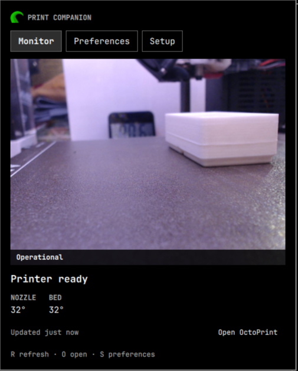
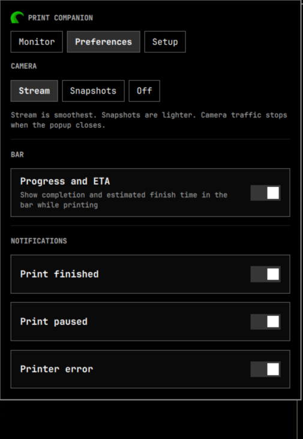

<p align="center">
  
</p>

<h1 align="center">Omarchy OctoPrint</h1>

<p align="center">
  An OctoPrint plugin for Omarchy
</p>

<p align="center">
  <a href="https://omarchy.org"></a>
  <a href="https://github.com/luxore/omarchy-octoprint/releases"></a>
  <a href="LICENSE"></a>
</p>

<table>
  <tr>
    <td width="50%" align="center"></td>
    <td width="50%" align="center"></td>
  </tr>
  <tr>
    <td align="center"><sub>Camera, state, temperatures, and the actions that matter</sub></td>
    <td align="center"><sub>One camera mode and a handful of useful preferences</sub></td>
  </tr>
</table>

Omarchy OctoPrint is a camera-first widget for the Omarchy bar. It stays
quiet while the printer is idle, shows progress and finish time during a job,
and opens into a focused monitor when the printer needs a closer look.

It is deliberately not another OctoPrint control panel. Uploads, movement,
terminal commands, preheating, and printer configuration remain in OctoPrint,
where their context and safeguards already exist.

## Install

```bash
omarchy plugin add https://github.com/luxore/omarchy-octoprint.git --enable
```

Open the OctoPrint mark in the bar. First run opens **Setup**:

1. Enter an IP address, DNS name, or full URL. Bare hosts use `http://`;
   explicit HTTP, HTTPS, ports, and reverse-proxy paths are preserved.
2. Choose **Connect in browser** to approve a dedicated OctoPrint application
   key, or paste an existing application/user API key and choose **Use key**.

The key travels to the helper over standard input and is stored in Secret
Service. It never enters `shell.json`, a URL, a process argument, or a file.

## At a glance

- Optional progress rail and finish ETA in horizontal and vertical bars.
- Camera-first popup with MJPEG stream, periodic snapshots, or camera off.
- Job name, remaining time, expected finish, nozzle, and bed temperature.
- Distinct printing, paused, cancelling, error, offline, and stale states.
- One notification per finished, paused, or failed transition.
- Immediate pause/resume and a deliberate two-step cancel.
- Automatic settings, browser authorization, and a masked manual-key fallback.
- One shared status poll across every display, with no camera traffic while the
  popup is closed.

## Use

| Input | Action |
|---|---|
| Left click | Open or close Omarchy OctoPrint |
| Middle click | Refresh status |
| `R` | Refresh status |
| `P` | Pause or resume the active print |
| `C` twice | Cancel within a five-second confirmation window |
| `O` | Open OctoPrint |
| `S` | Open Preferences |

Summon the popup from a script or Hyprland binding:

```bash
omarchy-shell shell toggle io.github.luxore.octoprint '{}'
```

The widget uses Omarchy's native bar geometry and can be dragged into place or
moved precisely:

```bash
omarchy bar move io.github.luxore.octoprint --section left
omarchy bar move io.github.luxore.octoprint --section center --index 0
omarchy bar move io.github.luxore.octoprint --section right
```

## Camera and refresh behavior

**Preferences** offers one camera choice: Stream, Snapshots, or Off. Stream mode
keeps one MJPEG connection open at five displayed frames per second. Snapshot
mode refreshes every 1.5 seconds. Either mode stops when the popup closes.

Status refreshes every five seconds while printing, paused, or open and every
60 seconds while idle. Independent OctoPrint endpoints are fetched
concurrently, and every display shares the same poll.

Standard OctoPrint camera routes work without setup. Unusual reverse-proxy
routes remain available through manifest settings or the CLI.

## Security

Use OctoPrint's application-key authorization whenever possible. The helper
stores one key per canonical server URL in the desktop keyring and retrieves it
directly for each request. Camera credentials are sent only to the configured
OctoPrint origin, and same-origin redirects are enforced.

Prefer HTTPS when the server supports it. HTTP sends the API key without
transport encryption and is suitable only for a trusted local network. Enable
OctoPrint Access Control before using this plugin.

**Forget saved key** removes the local credential. Revoke the application key
inside OctoPrint when it must also become invalid on the server.

Older OctoPrint installations without the Application Keys plugin can accept a
user-specific key interactively:

```bash
~/.config/omarchy/plugins/io.github.luxore.octoprint/bin/octoprint-companion \
  --url http://octopi.local authorize --manual
```

Do not use OctoPrint's global API key.

## CLI

The bar and scripts share a small JSON interface:

```bash
companion=~/.config/omarchy/plugins/io.github.luxore.octoprint/bin/octoprint-companion

"$companion" --url http://octopi.local status
"$companion" --url http://octopi.local snapshot
"$companion" --url http://octopi.local stream
"$companion" --url http://octopi.local command pause
"$companion" --url http://octopi.local command resume
"$companion" --url http://octopi.local command cancel
"$companion" --url http://octopi.local setting cameraMode snapshots
"$companion" --url http://octopi.local setting showProgress false
"$companion" --url http://octopi.local forget
"$companion" --url http://octopi.local configure \
  --snapshot-path /custom/snapshot --stream-path /custom/stream
```

Successful commands write one JSON object to standard output. `stream` writes
one JSON line per displayed frame until interrupted. Snapshot and stream files
remain mode `0600` in the user's runtime directory.

## Remove

Forget the local credential, revoke the matching application key in OctoPrint,
then remove the plugin:

```bash
companion=~/.config/omarchy/plugins/io.github.luxore.octoprint/bin/octoprint-companion
"$companion" --url http://octopi.local forget
omarchy plugin remove io.github.luxore.octoprint
```

## Development

Omarchy OctoPrint uses QML and Python's standard library. Its runtime dependencies
are already present in Omarchy: `python3`, `secret-tool`, and `xdg-open`.

```bash
omarchy plugin validate .
python3 -m unittest discover -s test -v
test/lint
```

Changes should preserve the companion boundary, the secret-handling contract,
and truthful state transitions. Open an issue before widening the product into
printer setup, file management, movement, heating, or arbitrary G-code.

## License and trademarks

Code is MIT. The bundled OctoPrint mark is reproduced from the official
[`mask-theme.svg`](https://github.com/OctoPrint/OctoPrint/blob/dev/src/octoprint/static/img/mask-theme.svg)
without changing its shape or colors and is not covered by the code license.

This plugin is compatible with OctoPrint but is not affiliated with,
supported by, or endorsed by the OctoPrint project or Gina Häußge.
[OctoPrint is a registered trademark](https://octoprint.org/trademark-rules/).
